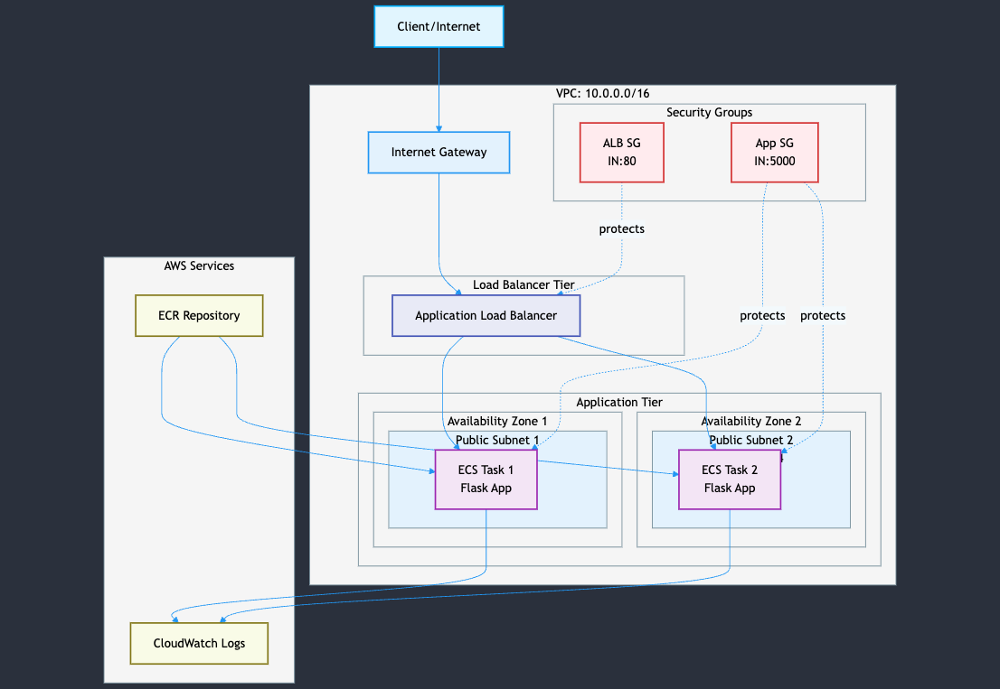

# AWS Load Balancer Demo

This project demonstrates a simple DevOps setup using AWS Application Load Balancer with a Flask application deployed using Terraform.

## Project Structure

```
.
├── app/
│   ├── app.py              # Flask application
│   ├── Dockerfile          # Docker configuration
│   └── requirements.txt    # Python dependencies
└── terraform/
    ├── main.tf            # Main Terraform configuration
    └── variables.tf       # Terraform variables
```

## Prerequisites

- AWS CLI configured with appropriate credentials
- Terraform installed (v1.0.0 or later)
- Docker installed (for building the application)
- Python 3.9 or later

## Setup Instructions

1. Configure AWS credentials:
   ```bash
   aws configure
   ```

2. Create ECR repository:
   ```bash
   aws ecr create-repository --repository-name flask-app-demo --region us-east-2
   ```

3. Initialize Terraform:
   ```bash
   cd terraform
   terraform init
   ```

4. Build and push Docker image:
   ```bash
   # Get AWS Account ID
   export AWS_ACCOUNT_ID=$(aws sts get-caller-identity --query Account --output text)

   # Authenticate Docker with ECR
   aws ecr get-login-password --region us-east-2 | docker login --username AWS --password-stdin $AWS_ACCOUNT_ID.dkr.ecr.us-east-2.amazonaws.com

   # Build image
   cd app
   docker build -t flask-app-demo .

   # Tag and push image
   docker tag flask-app-demo:latest $AWS_ACCOUNT_ID.dkr.ecr.us-east-2.amazonaws.com/flask-app-demo:latest
   docker push $AWS_ACCOUNT_ID.dkr.ecr.us-east-2.amazonaws.com/flask-app-demo:latest
   ```

5. Deploy the infrastructure:
   ```bash
   cd terraform
   terraform plan
   terraform apply
   ```

6. Get the ALB DNS name:
   ```bash
   aws elbv2 describe-load-balancers --query 'LoadBalancers[*].DNSName' --output text
   ```
   Visit this DNS name in your browser to see the application running.

## Architecture




This project sets up:
- A VPC with public subnets across 2 availability zones
- An Application Load Balancer
- Security groups for the load balancer
- A target group for the application
- An ECR repository for the Docker image
- ECS Cluster and Service for container orchestration
- A simple Flask application that returns the hostname

## Security Considerations

- The load balancer is configured with HTTP (port 80) for demonstration purposes. For production, configure HTTPS.
- Security groups are configured to allow only necessary traffic.
- The application runs in public subnets but can be moved to private subnets with NAT gateways for production.
- Consider implementing VPC endpoints for AWS services in production.
- Review and restrict IAM roles and policies for minimum required permissions.

## Cleanup

To avoid unnecessary charges, clean up your resources when done:

1. Remove all images from ECR repository:
   ```bash
   # Get your AWS account ID
   export AWS_ACCOUNT_ID=$(aws sts get-caller-identity --query Account --output text)

   # Delete all images from the repository
   aws ecr batch-delete-image \
       --repository-name flask-app-demo \
       --image-ids "$(aws ecr list-images \
       --repository-name flask-app-demo \
       --query 'imageIds[*]' \
       --output json)"
   ```

2. Delete the ECR repository:
   ```bash
   aws ecr delete-repository --repository-name flask-app-demo --region us-east-2 --force
   ```

3. Destroy the infrastructure:
   ```bash
   cd terraform
   terraform destroy
   ```
   Type `yes` when prompted to confirm the deletion of resources.

## Troubleshooting

1. If you get a 404 error when pushing Docker images, ensure the ECR repository exists by running the create repository command in step 2.

2. If the ALB health checks fail, verify that your Flask application is running on port 5000 inside the container.

3. Check CloudWatch logs for container issues if the service fails to start.

4. If you encounter the error "CannotPullContainerError: pull image manifest has been retried 5 time(s): image Manifest does not contain descriptor matching platform 'linux/amd64'", this means your Docker image was built for the wrong platform (common when building on Apple M1/M2 machines). To fix this:
   ```bash
   # Remove the old image
   docker rmi flask-app-demo:latest

   # Rebuild with platform specification
   cd app
   docker build --platform linux/amd64 -t flask-app-demo .

   # Retag and push
   export AWS_ACCOUNT_ID=$(aws sts get-caller-identity --query Account --output text)
   docker tag flask-app-demo:latest $AWS_ACCOUNT_ID.dkr.ecr.us-east-2.amazonaws.com/flask-app-demo:latest
   docker push $AWS_ACCOUNT_ID.dkr.ecr.us-east-2.amazonaws.com/flask-app-demo:latest

   # Force new deployment
   aws ecs update-service --cluster flask-app-cluster --service flask-app --force-new-deployment
   ```

## Contributing

Feel free to submit issues and enhancement requests!